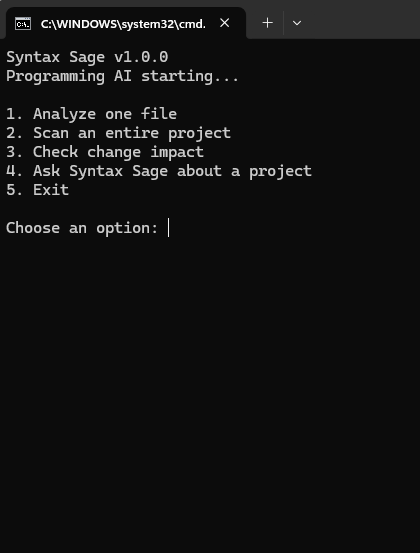
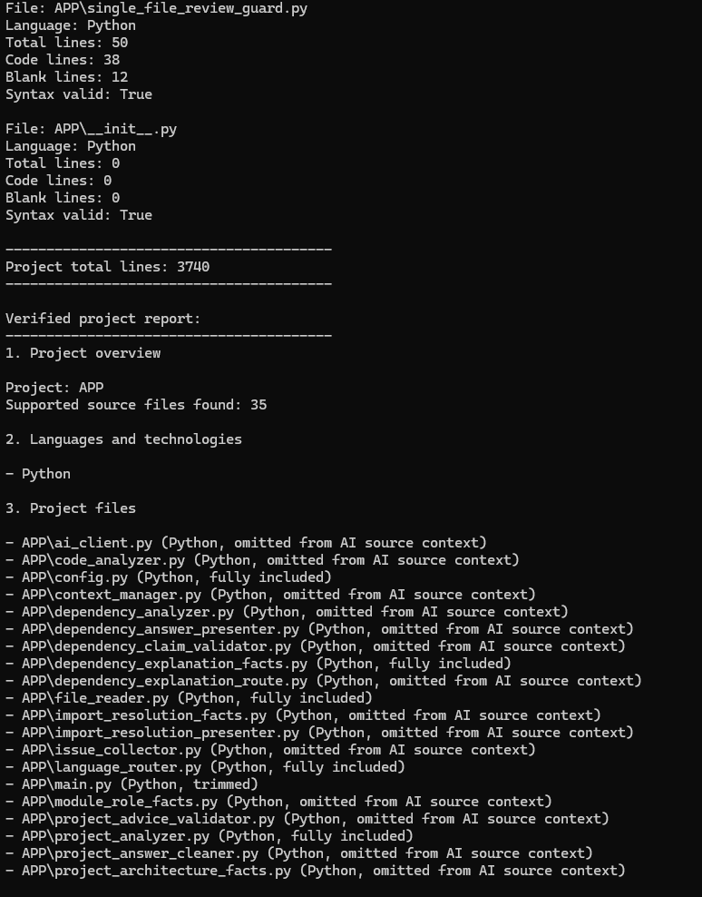
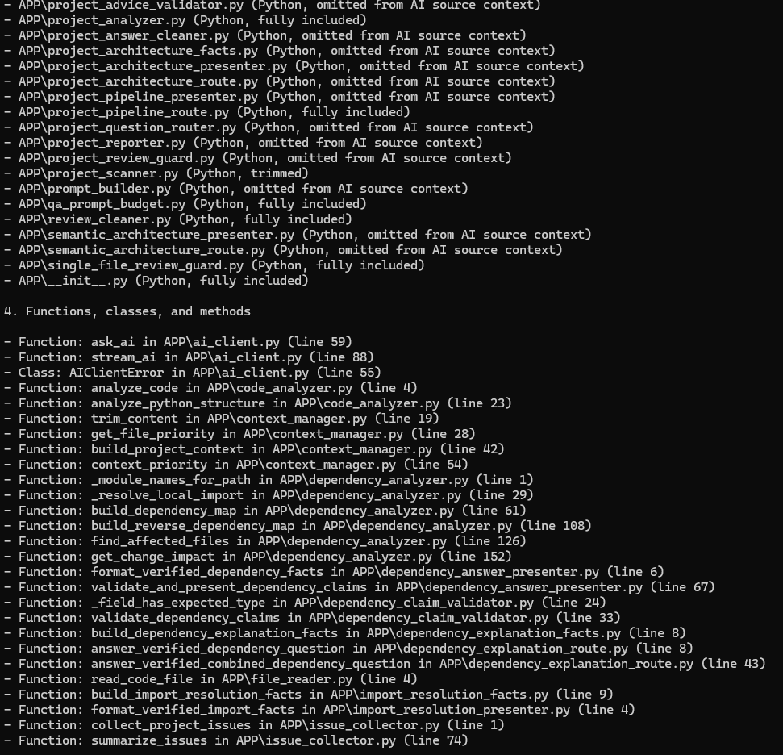
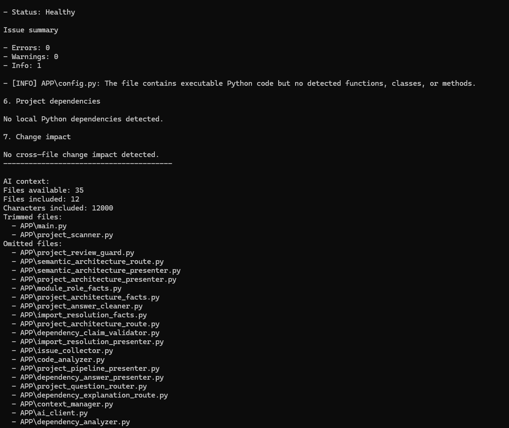
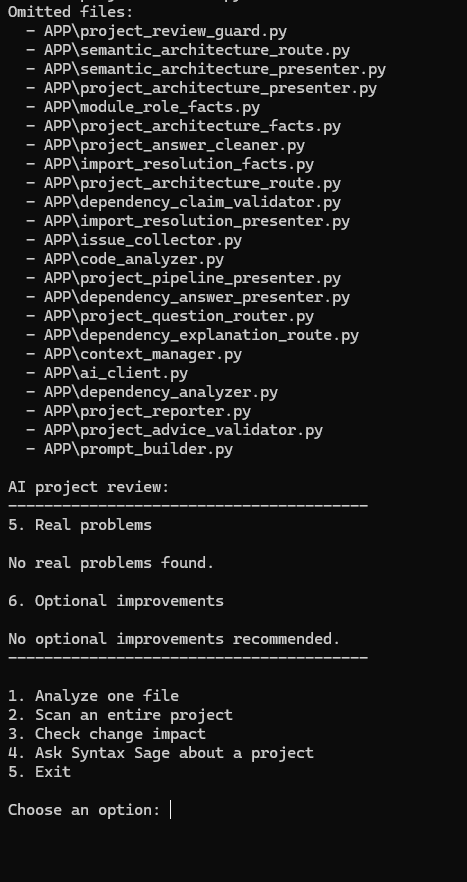

# Syntax Sage

[](https://github.com/sknox698-del/Syntax-Sage/actions/workflows/tests.yml)

## Screenshots

### Main CLI

Syntax Sage provides a command-line interface for single-file analysis,
whole-project scanning, change-impact analysis, and project Q&A.



### Verified Project Scan

Syntax Sage scans supported source files, analyzes project structure,
and builds a verified project report.



### Code Structure Analysis

The project scanner identifies functions, classes, methods, and their
locations throughout the analyzed source code.



### Project Health and Change Impact

Syntax Sage reports verified issues, project health, dependency information,
change-impact results, and the source context available for AI analysis.



### AI-Assisted Project Review

After deterministic analysis, Syntax Sage can perform an AI-assisted project
review while keeping conclusions grounded in verified project information.



**Syntax Sage v1.0.0** is a local AI-assisted programming analysis tool designed to inspect source code, analyze projects, trace Python dependencies, and answer questions about a codebase using verified project information.

Syntax Sage combines deterministic static analysis with AI-assisted explanations while applying safeguards intended to reduce unsupported or invented claims.

## Features

Syntax Sage currently provides five CLI options:

1. **Analyze one file**
   - Reads and analyzes a supported source file.
   - Detects language and basic code structure.
   - Reports verified issues.
   - Can provide an AI-assisted review.

2. **Scan an entire project**
   - Scans supported files in a project folder.
   - Builds a project-level analysis.
   - Reports languages, structure, issues, dependencies, and project health.

3. **Check change impact**
   - Analyzes local Python dependencies.
   - Finds files that depend directly or transitively on a selected file.
   - Does not claim that affected files are necessarily broken.

4. **Ask Syntax Sage about a project**
   - Answers questions using the analyzed project as context.
   - Supports verified explanations of project structure, module responsibilities, dependency behavior, and change impact.
   - Uses deterministic answers for questions that can be answered directly from verified analysis.
   - Uses AI only when appropriate.

5. **Exit**
   - Closes Syntax Sage cleanly.

## Requirements

Syntax Sage v1.0.0 has been tested with:

- Windows
- Python 3.14
- Ollama Python client 0.6.2
- A local Ollama installation

Python dependency:

```text
ollama==0.6.2
```

## Installation

### 1. Clone or copy the project

Place the Syntax Sage project in a folder such as:

```text
C:\ProgrammingAI
```

Open PowerShell in that folder.

### 2. Create a virtual environment

```powershell
python -m venv .venv
```

### 3. Activate the virtual environment

```powershell
.\.venv\Scripts\Activate.ps1
```

Your prompt should begin with:

```text
(.venv)
```

### 4. Install Python dependencies

```powershell
python -m pip install -r requirements.txt
```

### 5. Make sure Ollama is available

Syntax Sage uses the Ollama Python client to communicate with a local Ollama installation.

Make sure Ollama is installed and running and that the model configured for Syntax Sage is available locally.

## Running Syntax Sage

From the project root with the virtual environment activated:

```powershell
python -m app.main
```

Syntax Sage should display:

```text
Syntax Sage v1.0.0
Programming AI starting...

1. Analyze one file
2. Scan an entire project
3. Check change impact
4. Ask Syntax Sage about a project
5. Exit
```

## Example: Ask About a Project

Select:

```text
4
```

Enter a project folder:

```text
app
```

Then ask a question such as:

```text
Explain how dependency_analyzer.py resolves imports and traces affected files.
```

Syntax Sage can provide verified dependency information and distinguish verified facts from behavior that cannot be proven through static analysis.

## Dependency Analysis

Syntax Sage performs static local Python dependency analysis.

Its dependency system:

- Matches local Python imports against analyzed project files.
- Supports package-qualified imports.
- Treats package `__init__.py` files as their containing package.
- Avoids creating self-dependencies.
- Does not treat unresolved imports as confirmed local dependencies.
- Traces reverse dependencies to identify files potentially affected by a change.
- Excludes the target file itself from its affected-file list.

Change-impact results use this general structure:

```text
found
target
affected_files
```

For an existing target:

```text
found: True
target: original requested target
affected_files: dependent files
```

For a target that is not present in the dependency map:

```text
found: False
target: original requested target
affected_files: []
```

## Accuracy Safeguards

Syntax Sage includes several safeguards designed to keep its answers grounded in verified project information.

These include:

- Verified project facts
- Dependency claim validation
- Project review guards
- Single-file review guards
- Project answer cleaning
- Advice validation
- Prompt-budget controls
- Deterministic routing for questions that do not require AI
- Explicit limitations on unsupported runtime inference

Static dependency relationships indicate that a file **could** be affected by a change. They do not prove that the file will fail or contain a defect.

## Running Tests

Activate the virtual environment:

```powershell
.\.venv\Scripts\Activate.ps1
```

Then run:

```powershell
python -m unittest discover -s tests -v
```

The v1.0.0 release baseline contains:

```text
230 tests
```

A successful run ends with:

```text
OK
```

## Project Layout

The main application code is located in:

```text
app\
```

Automated tests are located in:

```text
tests\
```

Important components include:

```text
ai_client.py
code_analyzer.py
context_manager.py
dependency_analyzer.py
file_reader.py
issue_collector.py
language_router.py
main.py
project_analyzer.py
project_question_router.py
project_reporter.py
project_scanner.py
prompt_builder.py
```

Additional fact, validation, routing, presentation, and guard modules support verified project explanations and safer AI-assisted responses.

## Version

```text
Syntax Sage v1.0.0
```

## Current Status

Syntax Sage v1.0.0 has completed its core development and acceptance-testing phase.

Current release baseline:

- CLI operational
- Single-file analysis operational
- Project scanning operational
- Change-impact analysis operational
- Project Q&A operational
- Verified dependency explanations operational
- AI failure handling operational
- 230 automated tests passing
